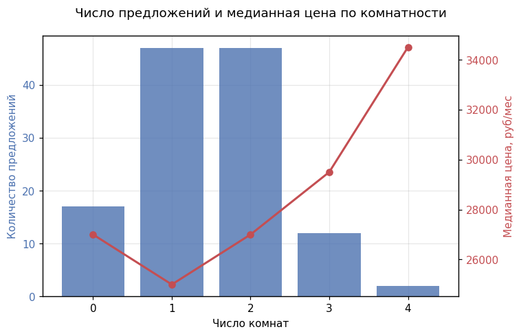
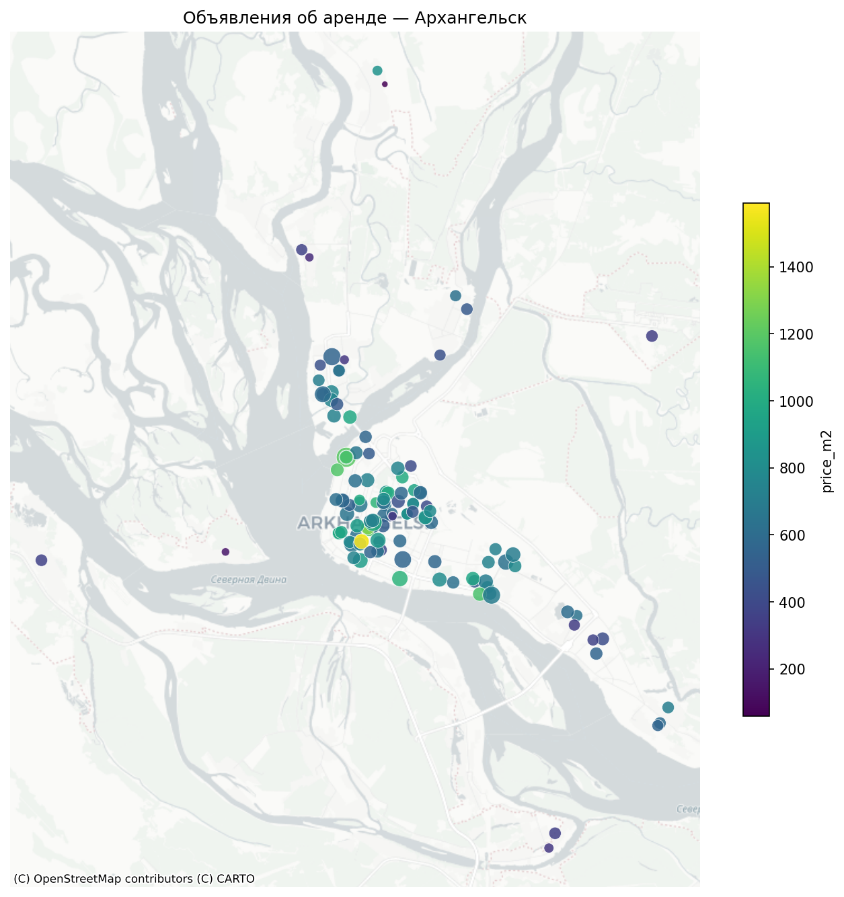

# Анализ рынка аренды квартир в Архангельске

## О проекте

Учебный pet-project по анализу рынка долгосрочной аренды квартир в Архангельске.

Цель проекта — пройти полный аналитический pipeline: от самостоятельного сбора данных с сайта недвижимости до подготовки данных, загрузки в PostgreSQL, SQL-анализа, расчёта аналитических метрик, визуализации и формирования выводов.

В рамках проекта сформирован датасет из **125 объявлений** об аренде квартир.

Основные задачи анализа:

* спарсить данные с сайта;
* провести подготовку и очистку датасета;
* спроектировать базу данных и создать таблицу в DBeaver, а также загрузить данные;
* написать SQL запросы для расчета метрик;
* сделать визуализацию результатов;
* сформулировать выводы;

---

## Источник данных

Данные собраны с сайта **Яндекс Недвижимость** со страницы объявлений долгосрочной аренды квартир в Архангельске.

Данные были получены самостоятельно с помощью Python-парсера на основе:

* `Requests`
* `BeautifulSoup`

### Собираемые данные

Для каждого объявления извлекались:

* идентификатор объявления;
* URL;
* количество комнат;
* стоимость аренды;
* размер залога;
* координаты;
* общая, жилая площадь и площадь кухни;
* этаж и этажность дома;
* год постройки;
* высота потолков.

### Ограничения сбора

Датасет отражает состояние предложений на момент парсинга. Количество объявлений и их характеристики могут изменяться со временем: новые объявления появляются, существующие снимаются с публикации, а данные в карточках могут обновляться.

Кроме того, часть характеристик объявлений отсутствует непосредственно в исходных данных.

---

## Стек технологий

| Задача                   | Инструменты                     |
| ------------------------ | ------------------------------- |
| Сбор данных              | Python, Requests, BeautifulSoup |
| Обработка данных         | Pandas, NumPy                   |
| Исследовательский анализ | Pandas, Matplotlib, Seaborn     |
| Хранение и анализ        | PostgreSQL                      |
| Работа с БД              | DBeaver                         |
| Разработка               | VS Code                         |

---

## Архитектура проекта / Pipeline

```text
Яндекс Недвижимость
        ↓
Python-парсер
(Requests + BeautifulSoup)
        ↓
CSV
        ↓
Очистка и подготовка
(Pandas / NumPy)
        ↓
PostgreSQL
        ↓
SQL-анализ
(агрегации + CTE + Window Functions)
        ↓
Визуализация
        ↓
Аналитические выводы
```

### 1. Сбор данных

Разработан Python-парсер, который получает страницы объявлений и извлекает структурированные характеристики квартир.

Результатом работы парсера является CSV-файл с данными об объявлениях.

### 2. Подготовка данных

С помощью Pandas выполнены:

* проверка структуры датасета;
* обработка типов данных;
* анализ пропусков;
* поиск дубликатов;
* проверка числовых диапазонов;
* выявление потенциальных аномалий;
* подготовка данных к загрузке в PostgreSQL.

### 3. SQL-хранилище

Для аналитической части спроектирована таблица `apartments` в PostgreSQL.

Данные из подготовленного CSV были загружены в БД и использовались как единый источник для SQL-анализа.

### 4. SQL-анализ

Основная аналитика выполнялась непосредственно в PostgreSQL.

Использовались:

* `GROUP BY`;
* агрегатные функции;
* подзапросы;
* CTE (`WITH`);
* оконные функции;
* `PARTITION BY`;
* `NTILE()`;
* `DENSE_RANK()`;
* процентильные функции.

### 5. Визуализация

Результаты анализа представлены с помощью графиков и пространственной визуализации объявлений на карте.

---

## Структура данных

Таблица PostgreSQL: `apartments`.

| Поле             | Тип                  | Описание                        |
| ---------------- | -------------------- | ------------------------------- |
| `offer_id`       | `integer`            | Идентификатор объявления        |
| `url`            | `text`               | Ссылка на объявление            |
| `rooms`          | `smallint`           | Количество комнат; `0` — студия |
| `price_month`    | `numeric`            | Стоимость аренды в месяц, ₽     |
| `deposit`        | `numeric`            | Размер залога, ₽                |
| `latitude`       | `double precision`   | Географическая широта           |
| `longitude`      | `double precision`   | Географическая долгота          |
| `area_total`     | `numeric`            | Общая площадь, м²               |
| `floor`          | `smallint`           | Этаж квартиры                   |
| `floors_total`   | `smallint`           | Количество этажей в доме        |
| `building_year`  | `integer`            | Год постройки                   |
| `area_living`    | `numeric`            | Жилая площадь, м²               |
| `area_kitchen`   | `numeric`            | Площадь кухни, м²               |
| `ceiling_height` | `numeric`            | Высота потолков                 |

---

## SQL-анализ

Запросы использовались не только для получения базовых статистик, но и для сравнения сегментов, ранжирования объявлений и расчёта относительных показателей.

### Базовые метрики

Рассчитаны:

* количество объявлений;
* средняя стоимость аренды;
* медианная стоимость аренды;
* средняя стоимость 1 м²;
* доля объявлений без залога.

Для расчёта медианы использовался процентиль:

```sql
SELECT
    PERCENTILE_CONT(0.5)
        WITHIN GROUP (ORDER BY price_month) AS median_price
FROM apartments;
```

### Анализ по количеству комнат

Рынок разделён на категории по количеству комнат:

* студии;
* 1-комнатные;
* 2-комнатные;
* 3-комнатные;
* 4-комнатные квартиры.

Для сравнения сегментов рассчитывались количество объявлений, средняя стоимость аренды и стоимость 1 м².

Оконная функция позволяет сравнить каждое объявление со средним значением соответствующего сегмента:

```sql
SELECT
    offer_id,
    rooms,
    price_month,
    price_month / area_total AS price_m2,
    AVG(price_month / area_total)
        OVER (PARTITION BY rooms) AS avg_price_m2_by_rooms
FROM apartments;
```

### Анализ этажности

Квартиры разделены на три категории:

* первый этаж;
* последний этаж;
* средний этаж.

Затем сравнивалась стоимость 1 м² между сегментами.

### Анализ года постройки

Дома сегментировались по периоду строительства:

* Historical;
* Soviet;
* Post-Soviet;
* Modern.

Для сегментов сравнивались показатели стоимости аренды и стоимости 1 м².

### Сегментация рынка по стоимости

Для распределения объявлений по ценовым сегментам применялся `NTILE()`.

```sql
SELECT
    offer_id,
    price_month / area_total AS price_m2,
    NTILE(4) OVER (
        ORDER BY price_month / area_total
    ) AS price_segment
FROM rent_offers;
```

### Ранжирование объявлений

Для ранжирования объектов по стоимости использовалась оконная функция `DENSE_RANK()`.

```sql
SELECT
    offer_id,
    rooms,
    price_month,
    DENSE_RANK() OVER (
        ORDER BY price_month DESC
    ) AS price_rank
FROM rent_offers;
```

### CTE

CTE (`WITH`) использовались для разделения сложной аналитической задачи на последовательные этапы.

Например:

```sql
WITH offers AS (
    SELECT
        offer_id,
        rooms,
        price_month,
        price_month / area_total AS price_m2
    FROM rent_offers
)
SELECT
    rooms,
    COUNT(*) AS offers_count,
    ROUND(AVG(price_m2), 2) AS avg_price_m2
FROM offers
GROUP BY rooms
ORDER BY rooms;
```

---

## Ключевые метрики

| Метрика                    |        Значение | Что показывает                                        |
| -------------------------- | --------------: | ----------------------------------------------------- |
| Количество объявлений      |         **125** | Размер собранной выборки                              |
| Медианная стоимость аренды |    **26 000 ₽** | Типичный уровень месячной арендной платы              |
| Средняя стоимость м²       | **695,35 ₽/м²** | Средний уровень стоимости аренды относительно площади |
| Доля объявлений без залога |         **39%** | Распространённость предложений без указанного залога  |

### Распределение предложений по комнатам

| Тип квартиры | Количество |
| ------------ | ---------: |
| Студии       |     **17** |
| 1-комнатные  |     **47** |
| 2-комнатные  |     **47** |
| 3-комнатные  |     **12** |
| 4-комнатные  |      **2** |

---

## Визуализация

Основные направления визуализации:

* распределение стоимости аренды;
* анализ стоимости аренды за 1 м²;
* сравнение квартир с разным количеством комнат;
* визуализация распределений числовых характеристик;
* сравнение ценовых сегментов;
* пространственное распределение объявлений на карте.

### Примеры визуализаций





---

При этом современные квартиры имеют меньшую медианную площадь (32 м² против 44 м² у советского фонда), поэтому высокая стоимость м² не всегда означает пропорционально более высокую ежемесячную аренду.
Ценовая сегментация показала, что Premium-объекты стоят в среднем 1 038 ₽/м², но их средняя месячная аренда составляет около 30,6 тыс. ₽ — близко к Standard (29,3 тыс. ₽). Это показывает важность анализа одновременно абсолютной цены и стоимости м².
Анализ структуры площади показал, что у 1-комнатных квартир медианная доля кухни составляет 23%, а жилой площади — 56%, тогда как у 3-комнатных квартир эти показатели составляют 13% и 70% соответственно.
Анализ отклонений внутри комнатности показывает, что объявления с одинаковой месячной ценой могут существенно различаться по стоимости 1 м². Например, две студии стоимостью 32 000 ₽ имеют цену 1 296 ₽/м² и 1 000 ₽/м² соответственно.
## Основные результаты

1. **75,2% предложения приходится на 1- и 2-комнатные квартиры** — по 37,6% на каждый сегмент.

2. **Медианная стоимость аренды по выборке составляет 26 000 ₽/мес., а средняя стоимость аренды 1 м² — 695 ₽/м² в месяц.** 

3. **Последние этажи имеют медианную стоимость 615 ₽/м², что примерно на 12% ниже, чем у квартир на средних этажах (700 ₽/м²).** 

4. **39% объявлений не требуют залога, что является заметной особенностью предложения на исследуемом рынке.** 

5. **Современный жилой фонд (2016+) имеет медианную стоимость 985 ₽/м² против 630 ₽/м² у домов 1961–1990 годов — примерно +56%.**

> Выводы относятся к собранной выборке из 125 объявлений и не являются оценкой всего рынка долгосрочной аренды Архангельска.

---

## Что показывает проект

Проект демонстрирует полный цикл работы Data Analyst с данными, начиная с их получения и заканчивая интерпретацией результатов.

### Data Collection

* самостоятельный сбор данных с веб-источника;
* разработка Python-парсера;
* работа с `Requests` и `BeautifulSoup`;
* формирование собственного датасета.

### Data Preparation

* работа с табличными данными в Pandas;
* анализ пропусков;
* проверка дубликатов;
* обработка типов данных;
* контроль диапазонов и аномалий;
* подготовка данных к загрузке в БД.

### Database & SQL

* проектирование структуры таблицы PostgreSQL;
* загрузка данных в БД;
* использование агрегатных функций;
* `GROUP BY`;
* CTE;
* подзапросы;
* оконные функции;
* `PARTITION BY`;
* `NTILE()`;
* `DENSE_RANK()`;
* расчёт процентилей.

### Analytics

* расчёт базовых и относительных метрик;
* сравнение сегментов;
* анализ стоимости 1 м²;
* сегментация рынка;
* поиск закономерностей в данных;
* формулирование аналитических выводов.

### Visualization

* построение графиков;
* визуальное сравнение сегментов;
* анализ распределений;
* пространственная визуализация объявлений на карте.

---

## Структура репозитория

```text
project/
├── data/
│   └── ...
│
├── parser.py
│   
├── eda.ipynb
│   
├── sql/
│   └── analysis.sql
│   
├── charts/
│   └── ...
│
└── README.md
```

### Назначение основных компонентов

| Компонент          | Назначение                                    |
| ------------------ | --------------------------------------------- |
| `data/`            | Исходный и подготовленный датасет             |
| `parser.py`        | Код сбора данных с сайта                      |
| `eda.ipynb`        | Исследовательский анализ и подготовка данных  |
| `sql/`             | SQL-запросы для проверки качества и аналитики |
| `charts/`          | Результаты визуализации                       |
| `README.md`        | Описание проекта, методов и результатов       |

---

## Ограничения проекта

Результаты необходимо интерпретировать с учётом ограничений исходных данных.

* Размер выборки — **125 объявлений**, поэтому она не позволяет делать статистически надёжные выводы обо всём рынке Архангельска.
* Данные отражают состояние рынка **на момент сбора**.
* Объявления могут быть сняты с публикации или изменены после парсинга.
* Часть характеристик содержит пропуски.
* Качество и полнота информации зависят от данных, указанных в объявлениях.
* Некоторые признаки нельзя напрямую интерпретировать без дополнительной проверки их семантики.
* Средние значения и сегментация чувствительны к структуре конкретной выборки.
* Пространственный анализ основан на координатах объявлений и не учитывает все факторы, влияющие на привлекательность конкретной локации.
* Полученные результаты следует рассматривать как **исследование собранной выборки**, а не как официальную статистику рынка аренды Архангельска.

---

### Key Product Insights

**1. Основной объём предложения сосредоточен в сегменте 1–2-комнатных квартир.**

На них приходится 75,2% всех объявлений — по 37,6% на каждый сегмент.

**2. Стоимость аренды существенно зависит от возраста жилого фонда.**

Медианная стоимость аренды составляет **26 000 ₽ в месяц**, что позволяет использовать эту величину как ориентир типичного предложения в исследуемой выборке.

**3. Цена относительно площади**

Медианная стоимость 1 м² в современных домах (2016+) составляет 984,63 ₽, против 630,43 ₽ в домах 1961–1990 годов — примерно на 56% выше. При этом современные квартиры имеют меньшую медианную площадь: 32 м² против 44 м².

**4. Последние этажи демонстрируют ценовой дисконт.**

Медианная стоимость 1 м² на последнем этаже составляет 615,38 ₽, что примерно на 12% ниже уровня средних этажей (700 ₽/м²). Это может быть полезным фактором для алгоритмов ранжирования и поиска потенциально выгодных предложений.

**5. Цена за м² и абсолютная стоимость аренды дают разные представления о привлекательности объекта.**

Например, Premium-сегмент имеет среднюю стоимость 1 037,57 ₽/м², но среднюю аренду около 30,6 тыс. ₽, лишь немного выше Standard (29,3 тыс. ₽). Высокая стоимость м² частично объясняется меньшей площадью объектов.

**6. Одинаковая месячная цена не означает одинаковую ценность предложения.**

В выборке две студии стоимостью 32 000 ₽/мес. имеют стоимость 1 м² 1 295,55 ₽ и 1 000 ₽ соответственно. Поэтому при сравнении объектов целесообразно учитывать одновременно абсолютную цену, площадь и стоимость 1 м².

**7. Структура площади меняется в зависимости от комнатности.**

У 1-комнатных квартир медианная доля кухни составляет 23% общей площади, тогда как у 3-комнатных — 13%. Доля жилой площади при этом увеличивается с 56% до 70%. Это может быть полезно при построении более детальных пользовательских сегментов и рекомендаций.

**8. 39% объявлений не требуют залога.**

Отсутствие депозита является заметной характеристикой предложения и потенциально может использоваться как отдельный фильтр при поиске жилья.
---
Ограничение: выводы основаны на **выборке из 125 объявлений** Архангельска и отражают структуру собранного предложения, а не весь рынок города. Выявленные различия являются описательными и не доказывают причинное влияние отдельных характеристик на цену.
---
